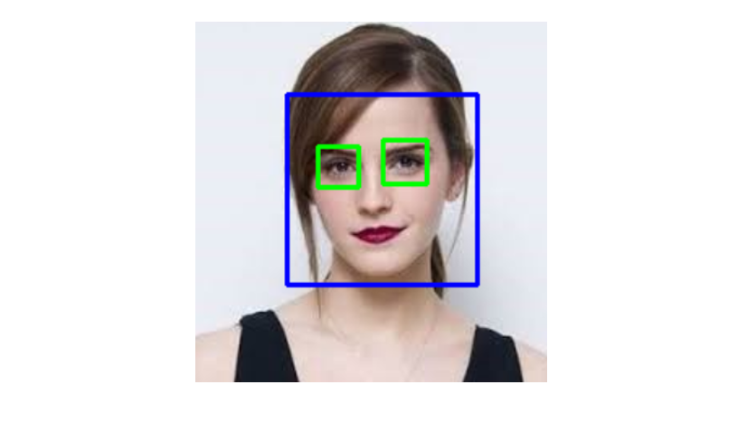

## Face Detection in Images & Real Time Video
The repo contains scripts for face detection and eye tracking in images or real-time video.   

# Prerequisites
- [OpenCV](https://opencv.org/) module
- Haar cascade file for face and eye detection

Image Source: [link](https://medium.com/dataseries/face-recognition-with-opencv-haar-cascade-a289b6ff042a)
